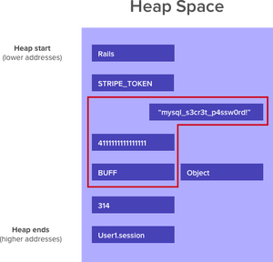

> 译文声明
> 本文是翻译文章，文章原作者BENOIT，文章来源：https://www.sqreen.io/ 
> 
> 原文地址：https://blog.sqreen.io/buffer-under-read-ruby/
> 
> 译文仅供参考，具体内容表达以及含义原文为准

一个新的令人兴奋的漏洞（对不起，我们很容易为这些事情感到兴奋😜）已经在Ruby中发布了。CVE-2018-8778是一个缓冲区整数溢出，由String#unpack触发。向发现这个漏洞的[Eyal Itkin](https://eyalitkin.wordpress.com/)致敬！在本文中，我们将深入探讨[这个漏洞](https://www.ruby-lang.org/en/news/2018/03/28/buffer-under-read-unpack-cve-2018-8778/)，展示如何利用漏洞以及如何防护漏洞。

# 什么是缓冲区under-read

我们所做的几乎所有有意义的计算都是基于存储在内存中的数据结构（对象）而完成的。

每个对象都有一个定义的大小和内存中的字段布局。因此，查看内存的人可以看到我们的对象被填充为为给定长度的二进制数据（零和一）。这就是我们所说的缓冲区（内存区域）。作为开发人员，在操作我们的对象时，我们应该在给定的缓冲区内工作，并且不应该在我们的对象被申请之前/之后进行读/写。

Ruby在所谓的堆上分配数据。堆是一个内存空间（另一个是栈）。几乎每个Ruby对象都会在那里保存。

因此，缓冲区under-read表示攻击者访问目标缓冲区之前内存位置的漏洞。这通常发生在指针或其索引递减到缓冲区之前的位置时。

这是一个严重的漏洞，但严重程度实际上取决于应用程序处理的数据。它可能会导致敏感信息的暴露或可能导致崩溃。您可能会泄漏数据，如 tokens，数据库凭据，会话cookie甚至是转账信用卡号码。

## CVE-2018-8778具体内容

这里是该漏洞的[公告](https://www.ruby-lang.org/en/news/2018/03/28/buffer-under-read-unpack-cve-2018-8778/)。为了更好地理解它，我们首先在[此处](https://github.com/ruby/ruby/commit/d02b7bd864706fc2a40d83fb6014772ad3cc3b80)深入研究修复提交的Ruby源代码（是的，可以看到它是SVN修订版，因为Ruby历史早于Git！）。

该漏洞位于String#unpack方法内部。此方法str根据提供的字符串格式进行解码，返回提取的每个值的数组（您可以在[RubyDoc](https://ruby-doc.org/core-2.5.0/String.html#method-i-unpack)上阅读更多关于它的信息）。格式字符串由一系列单字符指令（数字，“*”，“_”或“！”）组成，并可由@指定数据的位置。这就是问题所在。

从[测试](https://github.com/ruby/ruby/commit/d02b7bd864706fc2a40d83fb6014772ad3cc3b80#diff-66ede7a20d01949feaa42bf3f6ba2a5aR555)中，我们可以看到只需要使用特定的格式来触发它。这种格式字符串实际上就像一个小程序。字符串“@42C10”解码为：跳过42个字节，然后解码10个8位整数。

这里的问题是偏移量验证不足。如果用@传递一个很大的值，那么unpack会跳过负数个字节数。这就会解码缓冲区外的数据并返回。所以攻击者可以使用它来读取堆上的敏感数据。

未验证偏移量是一个经典的错误，称为[整数溢出](https://en.wikipedia.org/wiki/Integer_overflow)。当使用带符号整数时，试图解码一个巨大的无符号整数值，解码值将是一个负数。这给我们一种方法去返回一个负的偏移。与此相关，第一个阿丽亚娜5型火箭坠毁就是因为这个...[相关链接](https://hownot2code.com/2016/09/02/a-space-error-370-million-for-an-integer-overflow/)。

## 这个整数溢出如何在这里发生

String#unpack实际上是在C语言的Ruby核心源代码中定义的。正如我们在修复提交中所看到的，表示为字符串（C语言中的 char *）的偏移量必须转换为整数值。为此，Ruby使用一个调用宏STRTOUL，然后调用ruby_strtoul（在ruby.h中定义）。该名称似乎告诉了我们这将输出一个无符号的长整数。

    unsigned long ruby_strtoul(const char *str, char **endptr, int base);

直到这里，没有问题，字符串“18446744073709551416”被正确解码为长整数18446744073709551416。然而，这个值被存储在len中时被声明为一个有符号long整数。这样做将无符号数转换为有符号数。所以导致18446744073709551416变成-200。

以下一起讨论一些问题：

## 如何利用这个漏洞

在实时应用程序中利用漏洞的第一步是Poc验证。我们首先尝试从irb交互式shell 读取内存。我们将使用漂亮的[hexdump gem](https://github.com/postmodern/hexdump)来显示以便提供给读者更容易阅读的东西,为了简单我们使用单线程。

那么我们在这里做什么？我们有一个关于leak（leak）大小的参数，我们计算这个庞大的数字，然后将其解码为一个负整数。然后我们创建一个小缓冲区并使用这两个值使用格式字符串将其解压缩。我们基本上是这样说的：跳到这个巨大的偏移量（在-leak字节处结束）并读取leak + 4字节。

根据请求返回204字节。
通过传递一个大整数作为偏移量，我们在内存中开始BUFF之前返回了200个字节，然后读取204个字节（所使用的生成格式字符串：）@18446744073709551416C204。

作为完整性检查，我们可以在ASCII转储部分（BUFF）的末尾正确地看到我们应该使用的缓冲区的内容。如果Ruby不易受攻击，那么在BUFF开始之前，它不应该跳过去读取内存。

我们如何从PoC走向实际的利用？

我们首先需要找到一个运行在易受攻击的Ruby（<= 2.5.1）应用程序上的应用程序。Ruby on Rails应用程序就很好，因为我们可以远程攻击它，并且通常包含有趣的秘密。这个Rails应用程序需要有一个参数受攻击者控制的String#unpack调用format。String#unpack调用比你想象的更常见。它们通常用于解码来自其他地方的数据（像数据库驱动程序通常是此用户的用户）。因此，要知道您是否受到这个漏洞影响，您可能还需要查看所有依赖关系源代码...

如果我们有这样的应用程序，只需从上面发送我们生成的恶意格式字符串，就可以从应用程序中提取尽可能多的数据。这允许我们读取并且可能提取存储在存储器中的所有秘密（数据库凭证，令牌），还有那些仅通过应用程序（在并发请求中的客户信用卡号码或用户会话）转移的数据。

## 建立补救

当然，最简单的修复方法是简单地在您的机器上更新Ruby。在现实世界中，这并不总是可以快速实现的。现实促使我们制定了一个解决方案，即使目前还不能更新他们的Ruby版本，也可以保护所有Sqreen用户免受CVE-2018-8778的攻击。

Sqreen对于开发新的保护措施有两项主要要求。

    首先，我们不能以误报（即阻止合法请求）来破坏用户的应用程序  。
    其次，对性能的影响应该是几乎没有的的。

分析几个选项后，我们决定最好的解决方案是“简单地”挂钩该String#unpack方法，并检查包含的参数@在格式字符串中是否包含大偏移量。这里的关键是确保这个格式字符串不是来自当前的请求参数。

    TWO_GIGABYTES= 2**31
    return false unless format_string.include?('@')
    return false unless user_parameters.include?(format_string)
    offset = parse(format_string)
    return offset > TWO_GIGABYTES

现在我们来看一个例子：

    1.格式字符串`C10` 在第一行停止处理⇒未检测到攻击

    2.格式字符串“@10c12”
    	不在用户参数中 停止在第二行⇒未检测到攻击
    	如果它来自用户参数（代码可能很脆弱），我们检查偏移大小10并停止处理⇒未检测到攻击

    以`@ 18446744073709551416C204`作为格式字符串，偏移量`18446744073709551416`大于2 ** 31⇒检测到攻击并将被阻止！

就是这样。经过大量测试后，我们将此规则部署到我们的用户。现在，它们都受到保护，免受此缓冲区未充分读取的漏洞影响，并且可以在时间正确时更新其Ruby版本。所有这些都是在披露漏洞和充分保护我们的客户之间不到21个小时内实现的。
